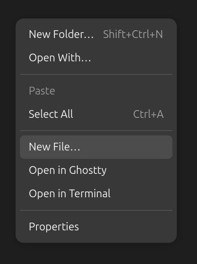
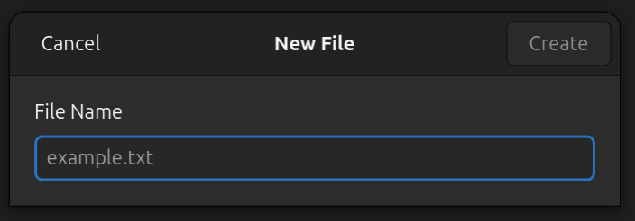

# nautilus-new-file

Adds a **"New File…"** option to the Nautilus (GNOME Files) right-click context menu — the missing counterpart to "New Folder…".

Type a filename with extension (e.g. `notes.md`, `script.py`, `data.csv`) and an empty file is created instantly.




## Features

- Native Adwaita dialog matching GNOME's "New Folder" style
- Works on **Ubuntu 24.04+ / GNOME 46 / Wayland**
- Enter to create, Escape / Cancel to dismiss
- Create button disabled until a name is entered
- Duplicate filenames auto-numbered (e.g. `notes (1).md`)
- Lightweight — two small Python files, no daemons

## Requirements

- GNOME Files (Nautilus) 46+
- Ubuntu 24.04 LTS or similar GNOME-based distro
- Python 3

## Install

```bash
git clone https://github.com/darikzen/nautilus-new-file.git
cd nautilus-new-file
chmod +x install.sh
./install.sh
```

Or manually:

```bash
sudo apt install python3-nautilus gir1.2-adw-1
mkdir -p ~/.local/share/nautilus-python/extensions
cp new_file_menu.py new_file_dialog.py ~/.local/share/nautilus-python/extensions/
nautilus -q
```

## Uninstall

```bash
chmod +x uninstall.sh
./uninstall.sh
```

## How it works

The extension consists of two files:

| File | Role |
|------|------|
| `new_file_menu.py` | Nautilus MenuProvider plugin — adds the context menu entry |
| `new_file_dialog.py` | Standalone GTK4/Adwaita dialog — launched as a subprocess |

The dialog runs as a separate process with `GTK_IM_MODULE=simple` to work around a GTK4 input method issue on Wayland where the Entry widget only accepts a single character when spawned from Nautilus.

## License

MIT
